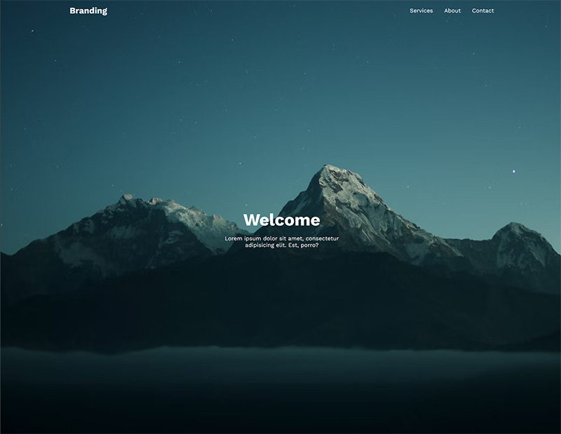

# Responsive Navbar - Reusable React Component

Reusable responsive navbar crated as a [React](https://react.dev/) component to speed up your development

## Table of contents

- [Overview](#overview)
    - [The gaols](#the-goals)
    - [Screenshot](#screenshot)
    - [Links](#links)
- [My process](#my-process)
    - [Built with](#built-with)
    - [What I learned](#what-i-learned)
    - [Continued development](#continued-development)
- [Author](#author)

## Overview

### The goals
- Navbar should look good on many different devices
- Users should be able to navigate between pages

### Screenshot

### Links

- Live Site URL: [Responsive Navbar](https://)

## My process

### Built with

- Semantic HTML5 markup
- CSS custom properties
- Flexbox
- [Next.js](https://nextjs.org/) - The React Framework for the Web
- [React](https://react.dev/) - The library for web and native user interfaces 

### Continued development

This section will outline areas that need continuing improvements or new components to be added. focusing on the future of the project. These could be concepts still not completely flushed out, or techniques that are new and need to be refined and perfected.

## Author

- Website - [Walker Designs](https://www.your-site.com)
- LinkedIn - [robert-walker-029503221](https://www.linkedin.com/in/robert-walker-029503221/)
- Twitter - [@RobertW15135868](https://twitter.com/RobertW15135868)
